# LLM Summariser Service

FastAPI-based asynchronous web service that summarizes text content from URLs using a local Ollama Gemma3:1B LLM. Supports concurrent requests, task progress tracking, and Docker containerization for easy deployment.

## Features

- **Asynchronous Processing**: Submit URLs for summarization and poll for results
- **Progress Tracking**: Real-time progress updates from 0% to 100%
- **Interactive API Documentation**: SwaggerUI available at `/docs` endpoint
- **Docker Support**: Complete containerized setup with Redis and Ollama
- **Robust Error Handling**: Comprehensive error responses and status tracking

## Quick Start

### Using Docker Compose (Recommended)

1. **Start the services**:
   ```bash
   docker compose up -d --build
   ```

2. **Access the API**:
   - API Base URL: `http://localhost:8000`
   - Interactive Documentation: `http://localhost:8000/docs`
   - OpenAPI Schema: `http://localhost:8000/openapi.json`

3. **Test the API**:
   ```bash
   # Create a summarization job
   curl -X POST "http://localhost:8000/documents/" \
        -H "Content-Type: application/json" \
        -d '{"name": "Example Article", "URL": "https://example.com"}'
   
   # Check job status (use the returned document_uuid)
   curl "http://localhost:8000/documents/{document_uuid}/"
   ```

## API Documentation

### Interactive Documentation

Visit `http://localhost:8000/docs` to access the interactive SwaggerUI documentation where you can:

- Explore all available endpoints
- View request/response schemas with examples
- Test API calls directly from the browser
- Download the OpenAPI specification

### Endpoints

#### Health Check
- `GET /health` - Service health status
- `GET /` - Service welcome message

#### Document Operations
- `POST /documents/` - Create a new summarization job
- `GET /documents/{document_uuid}/` - Retrieve job status and summary

### Request/Response Examples

#### Create Document
```json
POST /documents/
{
  "name": "FastAPI Tutorial",
  "URL": "https://fastapi.tiangolo.com"
}
```

Response:
```json
{
  "document_uuid": "4b1b2a5a-2f2c-4f18-8f7b-1d1a9f1f5c3e",
  "status": "PENDING",
  "name": "FastAPI Tutorial",
  "URL": "https://fastapi.tiangolo.com",
  "summary": null,
  "data_progress": 0.0
}
```

#### Get Document Status
```json
GET /documents/{document_uuid}/
```

Response (when complete):
```json
{
  "document_uuid": "4b1b2a5a-2f2c-4f18-8f7b-1d1a9f1f5c3e",
  "status": "SUCCESS",
  "name": "FastAPI Tutorial",
  "URL": "https://fastapi.tiangolo.com",
  "summary": "FastAPI is a modern, fast web framework for building APIs with Python...",
  "data_progress": 1.0
}
```

## Architecture

### System Overview

The LLM Summarizer Service is built with a microservices architecture using Docker Compose, featuring asynchronous processing, real-time progress tracking, and robust error handling.

### High-Level System Architecture

```mermaid
graph TB
    subgraph "Client Layer"
        Client[👤 Client Application]
        Browser[🌐 Web Browser]
    end
    
    subgraph "Docker Compose Network"
        subgraph "API Service"
            FastAPI[🚀 FastAPI Backend<br/>Port 8000]
        end
        
        subgraph "Data Layer"
            Redis[(🗄️ Redis<br/>Port 6379)]
        end
        
        subgraph "AI Service"
            Ollama[🤖 Ollama LLM<br/>Port 11434]
            Model[🧠 Gemma3:1B Model]
        end
        
        subgraph "Init Service"
            OllamaInit[⚡ Ollama Init<br/>One-time setup]
        end
    end
    
    subgraph "External Services"
        WebContent[🌍 Web Content<br/>HTTP/HTTPS URLs]
    end
    
    %% Client connections
    Client -->|HTTP REST API| FastAPI
    Browser -->|Interactive Docs| FastAPI
    
    %% Internal service connections
    FastAPI -->|Store/Retrieve Job State| Redis
    FastAPI -->|Generate Summaries| Ollama
    Ollama -->|Host Model| Model
    OllamaInit -->|Pull Model| Ollama
    
    %% External connections
    FastAPI -->|Fetch Content| WebContent
    
    %% Styling
    classDef clientStyle fill:#e1f5fe,stroke:#01579b,stroke-width:2px
    classDef apiStyle fill:#f3e5f5,stroke:#4a148c,stroke-width:2px
    classDef dataStyle fill:#e8f5e8,stroke:#1b5e20,stroke-width:2px
    classDef aiStyle fill:#fff3e0,stroke:#e65100,stroke-width:2px
    classDef externalStyle fill:#fce4ec,stroke:#880e4f,stroke-width:2px
    
    class Client,Browser clientStyle
    class FastAPI apiStyle
    class Redis dataStyle
    class Ollama,Model,OllamaInit aiStyle
    class WebContent externalStyle
```



### Data Flow Architecture

```mermaid
flowchart TD
    subgraph "Request Flow"
        A[📝 Client POST /documents/] --> B[🔍 Validate Input]
        B --> C[🆔 Generate UUID]
        C --> D[💾 Store in Redis<br/>Status: PENDING<br/>Progress: 0.0]
        D --> E[✅ Return 202 Accepted]
        E --> F[⚡ Start Background Task]
    end
    
    subgraph "Background Processing"
        F --> G[🌐 Fetch Web Content<br/>Progress: 25%]
        G --> H[📄 Extract Text Content]
        H --> I[🤖 Send to Ollama API<br/>Progress: 50%]
        I --> J[📝 Generate Summary<br/>Progress: 75%]
        J --> K[💾 Store Result in Redis<br/>Progress: 100%]
    end
    
    subgraph "Polling Flow"
        L[🔄 Client GET /documents/uuid/] --> M[🔍 Query Redis]
        M --> N{Status?}
        N -->|PENDING| O[📈 Return Progress]
        N -->|SUCCESS| P[📄 Return Summary]
        N -->|FAILED| Q[❌ Return Error]
    end
    
    subgraph "Data Storage"
        R[(🗄️ Redis Hash Structure<br/>document:uuid)]
        S[📋 Fields:<br/>• status<br/>• name<br/>• URL<br/>• summary<br/>• data_progress]
    end
    
    %% Connections
    D --> R
    K --> R
    M --> R
    R --> S
    
    %% Styling
    classDef requestStyle fill:#e3f2fd,stroke:#0277bd,stroke-width:2px
    classDef processStyle fill:#f1f8e9,stroke:#33691e,stroke-width:2px
    classDef pollStyle fill:#fff8e1,stroke:#f57f17,stroke-width:2px
    classDef storageStyle fill:#fce4ec,stroke:#c2185b,stroke-width:2px
    
    class A,B,C,D,E,F requestStyle
    class G,H,I,J,K processStyle
    class L,M,N,O,P,Q pollStyle
    class R,S storageStyle
```



### Asynchronous Workflow Sequence

```mermaid
sequenceDiagram
    participant Client
    participant FastAPI as 🚀 FastAPI API
    participant Redis as 🗄️ Redis Store
    participant WebContent as 🌍 Web Content
    participant Ollama as 🤖 Ollama LLM
    
    Note over Client,Ollama: Document Submission & Processing Workflow
    
    %% Initial submission
    Client->>+FastAPI: POST /documents/<br/>name, URL
    FastAPI->>FastAPI: Generate UUID
    FastAPI->>+Redis: HSET document:uuid<br/>status: PENDING, progress: 0.0
    Redis-->>-FastAPI: OK
    FastAPI-->>-Client: 202 Accepted<br/>document_uuid, status: PENDING
    
    Note over FastAPI: Background Task Starts
    
    %% Background processing
    FastAPI->>+WebContent: GET URL<br/>User-Agent: Mozilla/5.0...
    WebContent-->>-FastAPI: HTML Content
    FastAPI->>+Redis: HSET document:uuid<br/>progress: 0.25
    Redis-->>-FastAPI: OK
    
    FastAPI->>FastAPI: Extract readable text<br/>from HTML
    FastAPI->>+Redis: HSET document:uuid<br/>progress: 0.50
    Redis-->>-FastAPI: OK
    
    FastAPI->>+Ollama: POST /api/generate<br/>model: gemma3:1b, prompt
    Ollama-->>-FastAPI: Streaming Summary
    FastAPI->>+Redis: HSET document:uuid<br/>progress: 0.75
    Redis-->>-FastAPI: OK
    
    FastAPI->>FastAPI: Finalize summary text
    FastAPI->>+Redis: HSET document:uuid<br/>status: SUCCESS, summary, progress: 1.0
    Redis-->>-FastAPI: OK
    
    Note over Client,Ollama: Client Polling for Results
    
    %% Polling sequence
    loop Polling Loop
        Client->>+FastAPI: GET /documents/uuid/
        FastAPI->>+Redis: HGETALL document:uuid
        Redis-->>-FastAPI: Document Data
        FastAPI-->>-Client: Document Status<br/>status, progress, summary
        
        alt Status = PENDING
            Note over Client: Wait and retry
        else Status = SUCCESS
            Note over Client: Summary available
        else Status = FAILED
            Note over Client: Processing failed
        end
    end
    
    Note over Client,Ollama: Error Handling
    
    alt Network/Processing Error
        FastAPI->>+Redis: HSET document:uuid<br/>status: FAILED, progress: 1.0
        Redis-->>-FastAPI: OK
    end
```



### Services

- **FastAPI Backend**: Main API service running on port 8000
- **Redis**: In-memory data store for job state and results
- **Ollama**: Local LLM service hosting Gemma3:1B model
- **Ollama Init**: One-time setup container to pull the model

### Processing Flow

1. **Submit**: POST to `/documents/` with name and URL
2. **Process**: Background task fetches content and generates summary
3. **Track**: Poll `/documents/{uuid}/` to monitor progress
4. **Retrieve**: Get final summary when `status` is "SUCCESS"

### Status Values

- `PENDING`: Job is being processed
- `SUCCESS`: Summary completed successfully
- `FAILED`: Processing failed (check logs for details)

## Development

### Local Development

1. **Install dependencies**:
   ```bash
   cd fastAPI-backend
   poetry install
   ```

2. **Start services**:
   ```bash
   # Start Redis and Ollama
   docker compose up redis ollama -d
   
   # Start FastAPI (in another terminal)
   cd fastAPI-backend
   poetry run uvicorn app.main:app --reload --host 0.0.0.0 --port 8000
   ```

3. **Run tests**:
   ```bash
   cd fastAPI-backend
   poetry run pytest
   ```

### Environment Variables

- `REDIS_URL`: Redis connection string (default: `redis://localhost:6379`)
- `OLLAMA_HOST`: Ollama service URL (default: `http://localhost:11434`)

## Troubleshooting

### Common Issues

1. **Document not found (404)**:
   - Ensure you're using the correct UUID from the creation response
   - Check that the document exists in Redis

2. **Summary not available**:
   - Wait for background processing to complete
   - Check the `status` field - it should be "SUCCESS"
   - If status is "FAILED", check container logs for errors

3. **Ollama connection issues**:
   - Ensure Ollama service is running: `docker compose ps`
   - Check model is available: `docker exec ollama ollama list`

### Logs

```bash
# View API logs
docker logs summarizer-api

# View Ollama logs
docker logs ollama

# View Redis logs
docker logs redis
```

## Integration Tests

The project includes comprehensive integration tests that test concurrent operations with real Redis and Ollama services.

### Running Integration Tests

1. **Start the required services:**
   ```bash
   # Start Redis and Ollama
   docker-compose up redis ollama ollama-init
   
   # In another terminal, start the API
   docker-compose up api
   ```

2. **Run the integration tests:**
   ```bash
   cd fastAPI-backend
   
   # Option 1: Use the test runner script
   python run_integration_tests.py
   
   # Option 2: Run pytest directly
   pytest tests/test_integration_concurrency.py -v -s
   ```

### What the Integration Tests Cover

The integration tests (`test_integration_concurrency.py`) include:

- **Concurrent Document Creation**: Tests creating multiple documents simultaneously using various URLs from moonhoneytravel.com
- **Concurrent Document Retrieval**: Tests retrieving document status and summaries concurrently
- **Completion Verification**: Waits for all documents to complete processing and verifies summaries
- **Stress Testing**: Tests high-concurrency scenarios with multiple batches of requests

### Test URLs

The integration tests use real URLs from [Moon & Honey Travel](https://www.moonhoneytravel.com)(Just my favorite blog for hiking inspiration):
- Homepage and about page
- Country-specific travel guides (Dolomites, Slovenia, Austria, Switzerland, Italy, Spain, Portugal, Montenegro)

### Prerequisites

- Redis running on `localhost:6379`
- Ollama running on `localhost:11434` with `gemma3:1b` model
- API running on `localhost:8000`
- Internet connection (to fetch test URLs)

## License

MIT License - see LICENSE file for details.
